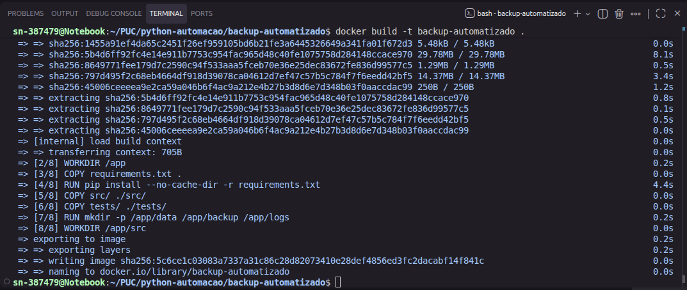
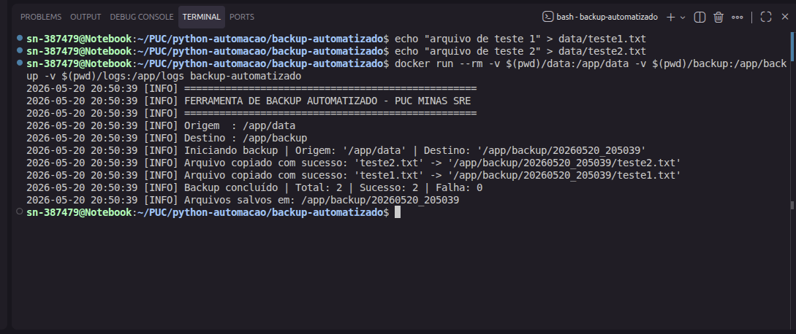
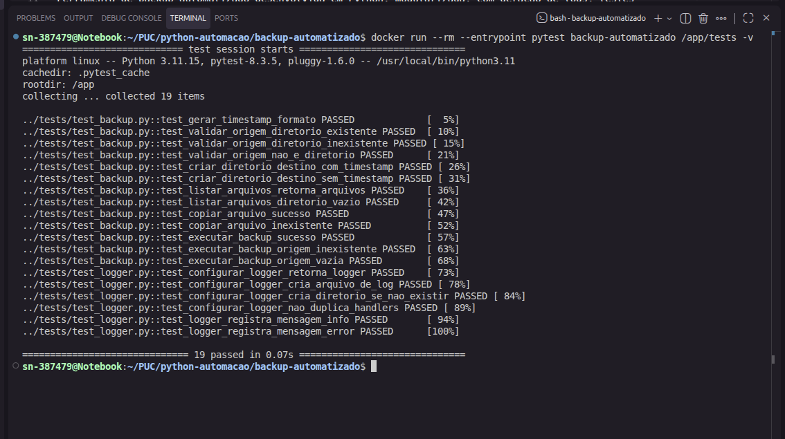

# Demonstração — Ferramenta de Backup Automatizado

**Disciplina:** Python para Automação em DevOps  
**Curso:** Site Reliability Engineering — PUC Minas  
**Professor:** Leandro Figueira Lessa

---

## 1. Build da Imagem Docker

Comando executado:

```bash
docker build -t backup-automatizado .
```

**Resultado:**



A imagem foi construída com sucesso em 8 etapas, incluindo instalação das dependências via `pip` e cópia dos módulos fonte e testes para o container.

---

## 2. Execução do Backup

Comandos executados:

```bash
echo "arquivo de teste 1" > data/teste1.txt
echo "arquivo de teste 2" > data/teste2.txt

docker run --rm -v $(pwd)/data:/app/data -v $(pwd)/backup:/app/backup -v $(pwd)/logs:/app/logs backup-automatizado
```

**Resultado:**



O backup foi executado com sucesso:
- Diretório de destino criado com versionamento por timestamp (`20260520_205039`)
- 2 arquivos copiados (teste1.txt e teste2.txt)
- Resumo final: Total: 2 | Sucesso: 2 | Falha: 0
- Logs registrados com nível INFO no console

---

## 3. Execução dos Testes Unitários

Comando executado:

```bash
docker run --rm --entrypoint pytest backup-automatizado /app/tests -v
```

**Resultado:**



Todos os 19 testes passaram com sucesso (100%), cobrindo:
- Geração de timestamp
- Validação de diretório de origem (existente, inexistente, não-diretório)
- Criação de diretório de destino (com e sem timestamp)
- Listagem de arquivos
- Cópia de arquivos (sucesso e falha)
- Execução completa do backup (sucesso, origem inexistente, origem vazia)
- Configuração do logger (criação de arquivo, diretório, handlers, registro INFO/ERROR)

---

## Conclusão

A ferramenta de backup automatizado funciona conforme esperado dentro do container Docker, realizando cópias versionadas por timestamp, gerando logs estruturados e passando em todos os testes unitários.
